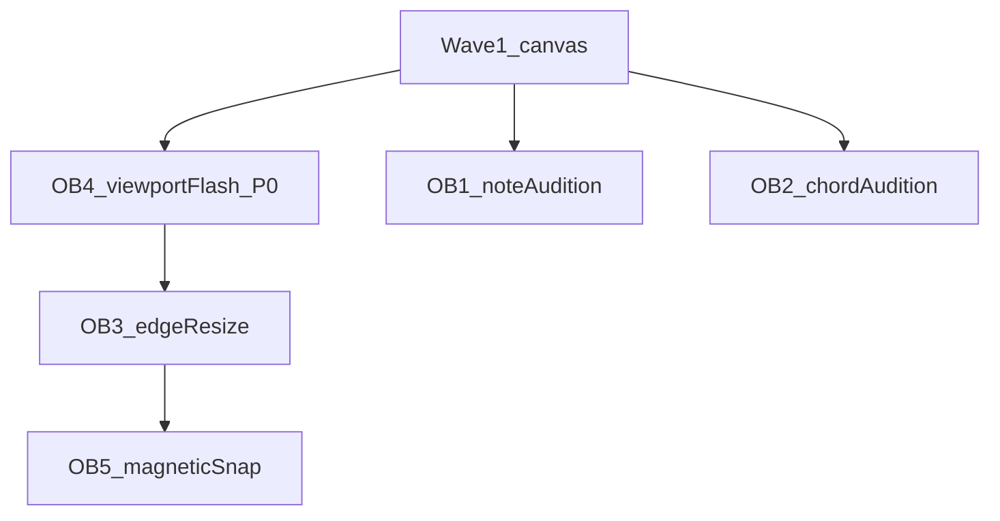

# UI remediation — operator backlog (supplements REF_AUDIT_1)

> Items from **operator / HITL notes** (2026-04-16). They are **not** covered by [REF_AUDIT_1.md](REF_AUDIT_1.md), which compares screenshots to reference layout.  
> Cross-link: [ui_remediation_sequencing_ec8db0c2.plan.md](../../ui_remediation_sequencing_ec8db0c2.plan.md).

| ID | Issue | Suggested priority | Suggested wave / owner notes |
|----|--------|----------------------|------------------------------|
| **OB-1** | **No sound when clicking a note** — should audition the note (preview). | P1 — interaction parity with typical DAW/editor UX | After [PAT-026](../../PATTERNS.md) audio init: wire click → short `Tone` preview or existing sampler path. Fits **post–Wave 1** canvas hit-test (knows which note). May land in **Wave 3–5** or a thin **“preview”** task parallel to shell work. Depends on `initializeAudio()` user-gesture context for first interaction. |
| **OB-2** | **No sound when clicking a chord** — should audition the chord. | P1 | Same as OB-1; use voicing engine / chord playback helper. Hit-test chord blocks or chord strip (Wave 2). |
| **OB-3** | **Resize notes by dragging edges** — behavior appears missing. | P1 — core editing | **Wave 1** acceptance should explicitly include **resize handles** at note ends if not already in [EditorCanvas](../../client/src/components/editor/EditorCanvas.tsx) drag session; else **immediate follow-up** task on same files as RA-3 (`hitTest`, pointer drag). |
| **OB-4** | **Dragging a note: viewport flashes / disappears** (often stays broken). | **P0 — defect** | Treat as **bugfix** alongside Wave 1 drag work (`requestAnimationFrame` / state updates causing full remount?). Repro + fix before heavy feature work on top of broken drag. |
| **OB-5** | **Move/resize should softly snap** to beat boundaries and **major beat fractions** (gentle bump, not hard lock). | P2 — feel | [pointerMath](../../client/src/components/editor/pointerMath.ts) / tick quantization with **magnetic** threshold (document constants). Natural fit **with OB-3/4** on the same pointer pipeline; can ship after P0 flash fix. |
| **OB-6** | **Whole UI too large** — needs fullscreen; should be comfortable windowed. | P2 — density / chrome | **Wave 6–7** (layout consolidation + palette density) and/or **Designer**: default scale, compact toolbar height, panel padding, optional `text-sm` / token step-down. Related: **RA-16** zoom vs **UI** scale (browser zoom is a workaround, not the product fix). May need **UX_GUIDELINES** token review — escalate if changing global scale. |

## Dependency sketch

**Parallel:** OB-1 / OB-2 (preview) do not block each other. **OB-6** (global UI density) is addressed primarily in **Waves 6–7** and may involve **Designer + UX_GUIDELINES** review — not on the same critical path as OB-4→5.

## Briefing discipline

- Use IDs **OB-1 … OB-6** in task briefs so Reviewer can trace to this file.
- Do not conflate with **RA-*** audit IDs.

---

*Last updated: 2026-04-16.*

OB-7: Can't drag/resize notes or chords outside of their current measure.
OB-8: Clicking on the grid does not reposition the cursor.
OB-9: Dragging notes does not give any visual indication that you're dragging (they should move as you're dragging, not on mouse button up)
OB-10: There's no undo/redo function anywhere that I could find.
OB-11: The "Search" button in the Chords panel does nothing. 
OB-12: The "Popular" button in the Chords panel only ever has one chord in it. Research may be required to know what this is supposed to do and how it works.
OB-13: Clicking a chord or note should insert it at the cursor. Right now the point of insertion is unpredictable.
OB-14: Piano roll should show only the range of melody notes used in each line, with a minimum of one octave.
OB-15: More than one line of the song should render on the screen, if it will fit. 
OB-16: The page should not continue below the grid. If the side panels are too long to fit, have them scroll (not the whole page)