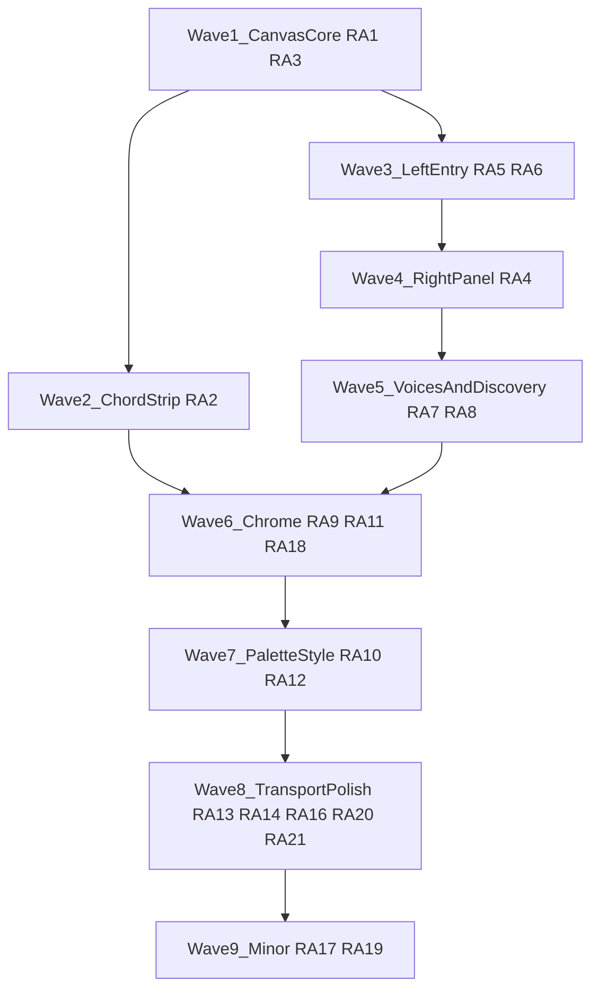

# UI remediation execution order (REF_AUDIT_1)

## Detailed breakdown documents

- Waves 2–3: [docs/audit/UI_REMEDIATION_WAVES_2_3.md](docs/audit/UI_REMEDIATION_WAVES_2_3.md) (RA-2, RA-5, RA-6)
- Waves 4–6: [docs/audit/UI_REMEDIATION_WAVES_4_6.md](docs/audit/UI_REMEDIATION_WAVES_4_6.md) (RA-4, RA-7/RA-8, RA-9/RA-11/RA-18)
- Waves 7–9: [docs/audit/UI_REMEDIATION_WAVES_7_9.md](docs/audit/UI_REMEDIATION_WAVES_7_9.md) (RA-10/RA-12, RA-13–16/20–21 + RA-15 gate, RA-17/RA-19)
- Operator backlog (not in REF_AUDIT_1): [docs/audit/UI_REMEDIATION_OPERATOR_BACKLOG.md](docs/audit/UI_REMEDIATION_OPERATOR_BACKLOG.md)

## Operator backlog (supplements REF_AUDIT_1)

[REF_AUDIT_1.md](docs/audit/REF_AUDIT_1.md) is a **visual/reference** audit. The following **interaction / feel / density** items were tracked separately (see full table in [UI_REMEDIATION_OPERATOR_BACKLOG.md](docs/audit/UI_REMEDIATION_OPERATOR_BACKLOG.md)):

| ID | Summary | Where it lands |
|----|---------|----------------|
| OB-1 | Audition **note** on click | Post–Wave 1 preview + playback engine |
| OB-2 | Audition **chord** on click | Same; ties to chord hit-test / Wave 2 strip |
| OB-3 | **Edge-drag resize** for notes | Wave 1 interaction / hit-test (or immediate follow-up) |
| OB-4 | **Viewport flash / loss** while dragging notes | **P0 defect** — fix with Wave 1 drag pipeline |
| OB-5 | **Magnetic snap** (soft bump) on move/resize | Pointer math — with OB-3/4 |
| OB-6 | **UI too large** — windowed comfort | Waves 6–7 + possible UX token / Designer |

## Preconditions (TL)

- Canonical alignment: [ARCHITECTURE.md](ARCHITECTURE.md) already specifies pitch/tick spaces, canvas layer order, and `CHORD_AREA_HEIGHT` / note geometry ([UX_GUIDELINES.md](UX_GUIDELINES.md) §6 + [PATTERNS.md](PATTERNS.md) PAT-012). Remediation is **bringing implementation in line with those contracts and the reference**, not re-deciding architecture.
- **Product scope flag before building RA-15 (Band / Lyrics / Stable):** ARCHITECTURE lists full band and rich lyrics as **out of scope / deferred**; stub toolbar buttons vs omit vs HITL scope change must be decided **before** a Builder brief, or the item stays deferred.
- **Parallelism default:** Treat [client/src/app/EditorLayout.tsx](client/src/app/EditorLayout.tsx) as a **merge hotspot** (transport, palette, loop bar, right rail, measure bar). Per Tech Lead rules: parallel Builders only when file scopes are disjoint; otherwise **sequence** waves.

## Severity map (audit rank)

| Tier | IDs | Theme |
|------|-----|--------|
| 5 | RA-1–3 | Piano roll fidelity: pitch axis + rows, horizontal note bars, dedicated chord strip |
| 4 | RA-4–8 | Right properties panel, left duration + note entry, multi-voice, chord discovery tabs |
| 3 | RA-9–12 | Shell/toolbar structure, palette visual language, loop row consolidation, demote secondary/borrow CTAs |
| 2 | RA-13–18 | Transport extras, zoom, placeholder cleanup, export cluster placement |
| 1 | RA-19–21 | Labels, tempo affordance position, orphan “1:1” |

## Recommended execution waves (efficiency + rank)

Order prioritizes **unlocking the central editor** and **reducing rework** (fix layout/model presentation before rechroming chrome).

### Wave 1 — Canvas core (RA-1, RA-3) — **Severity 5, sequential with each other**

- **Rationale:** Pitch rows and horizontal duration bars are one **viewport + renderer + hit-test** vertical slice ([client/src/components/editor/EditorCanvas.tsx](client/src/components/editor/EditorCanvas.tsx), [client/src/engine/renderer/noteBlocks.ts](client/src/engine/renderer/noteBlocks.ts), [client/src/engine/renderer/hitTest.ts](client/src/engine/renderer/hitTest.ts), [client/src/components/editor/pointerMath.ts](client/src/components/editor/pointerMath.ts)). Fixing RA-1 without RA-3 (or the reverse) leaves a contradictory UX.
- **Deliverable shape:** One task brief (Builder + concurrent QA) with acceptance criteria tied to **visible canvas behavior** (aligns with ROADMAP Phase 8.3 intent: seeded content visibly rendered — already a project priority).

---

### Wave 2 — Chord track strip (RA-2) — **Severity 5, after Wave 1**

- **Rationale:** Dedicated bottom chord timeline is a **layout + chord renderer** concern (uses `CHORD_AREA_HEIGHT`, strip vs main note area). Depends on stable vertical layout from Wave 1 so the strip does not get ripped out by pitch-grid refactors.
- **Alternative considered:** Merge RA-2 into Wave 1 — valid if the same Builder owns all canvas files and CI time is acceptable; **risk** is a larger PR and Reviewer context. Prefer **split** if you want smaller review surface.

### Wave 3 — Left panel entry (RA-5, RA-6) — **Severity 4, together**

- **Rationale:** Duration + per-note entry are the **minimum** to exercise the piano roll from the UI (audit: keyboard path alone is insufficient for reference parity). Likely touches [client/src/components/panels/ChordPalette.tsx](client/src/components/panels/ChordPalette.tsx) / editor shell wiring in `EditorLayout` — keep **one branch** unless grep shows clean file split.

### Wave 4 — Right properties panel (RA-4) — **Severity 4, after Wave 3**

- **Rationale:** Large React surface (melody: voices, visibility, inactive display, smart octave; chord: type, inversion, extensions, secondary, borrow). Depends on **store/UI patterns** for active voice and chord edit — ensure [INTERFACES.md](INTERFACES.md) already exposes needed props/selectors; if not, **TL updates INTERFACES first** (frozen file — no Builder starts until resolved).
- **Parallelism:** Do **not** parallel with Wave 3 on the same branch if both hammer `EditorLayout.tsx` without a clear split; **sequence** 3 → 4 unless delegated to separate worktrees with isolated regions (high coordination cost).

### Wave 5 — Multi-voice + discovery (RA-7, RA-8) — **Severity 4**

- **RA-7** (voices): ties to UI store + scheduler assumptions; depends on Wave 4 if “Active Melody Voice” lives in the new right panel — often **same milestone as RA-4** or immediately after.
- **RA-8** (tabs: Magic, Popular, Search, Progressions, Bass Sets): substantial feature surface; **depends** on chord theory/palette infrastructure. May be **one fat task** or **split by tab** into sequential PRs to limit merge pain.
- **Alternative:** Implement RA-7 before full RA-8 if reference priority is **note editing** over **progression library**.

### Wave 6 — Shell consolidation (RA-9, RA-11, RA-18) — **Severity 3 + 2**

- **Rationale:** Reference is **one compact toolbar row**; UX §5.8 already defines MIDI export cluster anatomy — [UX_GUIDELINES.md](UX_GUIDELINES.md) §5.8, §7. Rebuilding chrome **before** Waves 1–5 risks repeated edits to `EditorLayout`. **RA-11** (fold loop into toolbar) and **RA-18** (move export out of busy transport) fit naturally here.
- **Order inside wave:** Structure regions first (RA-9), then remove redundant loop row (RA-11), then relocate export per §5.8 (RA-18).

### Wave 7 — Palette density + hierarchy (RA-10, RA-12) — **Severity 3**

- **Rationale:** Mostly **Tailwind + component structure** once panel regions are stable. RA-12 (demote “Cycle secondary” / “Clear to diatonic”) pairs with RA-4 if those affordances move to right panel — if RA-4 already landed, this wave is **style + relocation cleanup**.

### Wave 8 — Transport + zoom affordances (RA-13, RA-14, RA-16, RA-20, RA-21) — **Severity 2**

- **RA-13/14:** Record + Click — verify playback store / Tone hooks exist; no new architecture if scoped as UI toggles wired to existing behavior.
- **RA-16:** Zoom controls — depends on **viewport model** stabilized in Wave 1 (otherwise zoom multiplies layout bugs).
- **RA-20/21:** Move tempo/meter affordance; remove or wire “1:1” — quick wins **after** zoom story is clear.
- **RA-15 (Band, Lyrics, Stable):** **Gate on scope decision** (see Preconditions). If deferred, document as **won’t-fix for MVP** in the brief to avoid churn.

### Wave 9 — Minor (RA-17, RA-19) — **Severity 1**

- Placeholder “Applied chords” / ROMAN section (RA-17): remove or populate after chord UI truth is settled.
- Labels + Reset (RA-19): copy and small control additions.

## Parallelism and resource allocation

| Strategy | When to use |
|----------|-------------|
| **1 Builder + 1 QA** per wave | Default — matches TL brief format and reduces `EditorLayout` conflicts. |
| **2 Builders in parallel** | Only after TL verifies **non-overlapping paths** (e.g., one owns `engine/renderer/**` only, another owns a **new** right-panel file not yet touching `EditorLayout`). Challenging here because shell is monolithic. |
| **Worktrees (PAT-017)** | Mandatory if two PRs overlap in time; each gets its own branch directory + **distinct E2E ports (PAT-030)**. |

**Suggested staffing:** One primary Builder sequence through Waves 1–6 (highest skill: canvas + app shell), then optional second Builder for Wave 5b (discovery tabs) if Wave 5 is split and file ownership is clean.

## Token usage (briefing and review discipline)

- **Reference audit IDs in every brief** (e.g. “Addresses RA-1, RA-3”) so agents do not re-derive requirements from images — **saves tokens** on Builder/Reviewer rounds.
- **Prefer fewer, denser acceptance criteria** over narrative; point to `REF_AUDIT_1.md` + `UX_GUIDELINES.md` section anchors instead of pasting screenshots into prompts.
- **Avoid spawning parallel subagents** for exploratory research on the same audit — single Researcher brief only if INTERFACES or scope is ambiguous.
- **Reviewer once per wave**, not per micro-commit, to cap review context.

## Alternatives (explicit)

1. **Big-bang canvas PR (RA-1–3 in one):** Faster integration, harder review; use only with strong QA canvas tests first (concurrent QA brief mandatory).
2. **Chrome-first (RA-9 before RA-1):** Faster visible “looks like reference” shell, **high risk** of thrash when canvas dimensions change — not recommended.
3. **Right panel before left entry (swap Waves 3–4):** Possible if chord-focused milestone; melody-first reference suggests current order.

## Designer touchpoint

- Waves 6–7 (toolbar, palette density) should align with **UX_GUIDELINES.md** tokens and §5.8; if reference conflicts with frozen UX, **escalate to Designer** before Builder work — TL does not unilaterally edit `UX_GUIDELINES.md`.
